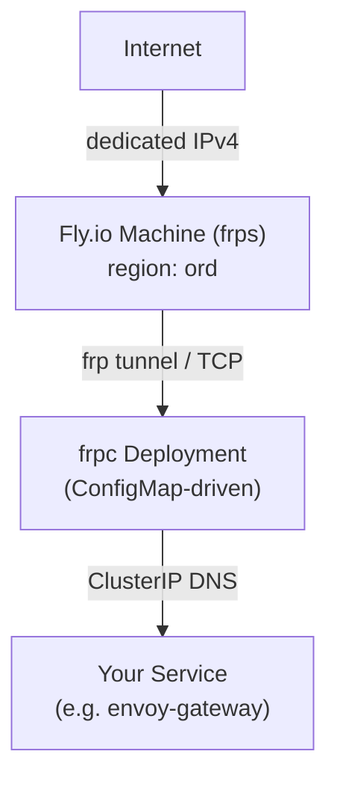

# Fly® Tunnel Operator

A Kubernetes operator that fulfills `Service type: LoadBalancer` requests by provisioning [frp](https://github.com/fatedier/frp) tunnels through [Fly.io](https://fly.io) Machines.

Designed for homelabs and environments without a cloud provider's load balancer integration, fly-tunnel-operator gives every `LoadBalancer` Service a real public IPv4 address routed through Fly.io's global anycast network.

## How it works



Traffic from the internet hits the dedicated IPv4 address allocated on Fly.io, which routes to an `frps` (frp server) process running on a Fly Machine. The frp server forwards the TCP stream over an encrypted tunnel to an `frpc` (frp client) Deployment running inside the Kubernetes cluster. The frpc pod then delivers the traffic to the target Service via its ClusterIP, completing the path from the public internet to your in-cluster workload without requiring any inbound firewall rules.

When a `Service` with `type: LoadBalancer` and `spec.loadBalancerClass: fly-tunnel-operator.dev/lb` is created, the operator:

1. Creates a dedicated Fly.io App for the Service
2. Creates a Fly.io Machine running `frps` (frp server) inside that app
3. Allocates a dedicated IPv4 address on Fly.io
4. Deploys an `frpc` (frp client) Deployment in-cluster with a generated TOML config
5. Patches the Service's `.status.loadBalancer.ingress` with the public IP

When the Service is deleted, the operator tears down everything in reverse (frpc Deployment + ConfigMap, IP, Machine, Fly App) using a finalizer.

## Prerequisites

- A Kubernetes cluster (any distro: k3s, kind, EKS, GKE, etc.)
- A [Fly.io](https://fly.io) account with an API token
- Helm 3

## Installation

### Via Helm

```bash
helm install fly-tunnel-operator oci://ghcr.io/zhming0/charts/fly-tunnel-operator \
  --namespace fly-tunnel-operator-system \
  --create-namespace \
  --set flyApiToken=<YOUR_FLY_API_TOKEN> \
  --set flyOrg=<YOUR_FLY_ORG_SLUG> \
  --set flyRegion=ord
```

### Configuration

| Parameter | Default | Description |
|---|---|---|
| `flyApiToken` | (required) | Fly.io API token |
| `flyOrg` | (required) | Fly.io organization slug (e.g. `personal`) |
| `flyRegion` | (required) | Fly.io region (e.g. `ord`, `sjc`, `lhr`) |
| `existingSecret` | `""` | Name of a pre-existing Secret containing `fly-api-token` |
| `flyMachineSize` | `shared-cpu-1x` | Machine size preset |
| `loadBalancerClass` | `fly-tunnel-operator.dev/lb` | LoadBalancer class to watch |
| `frpsImage` | `snowdreamtech/frps:0.61.1@sha256:f18a...` | Container image for frps (digest-pinned) |
| `frpcImage` | `snowdreamtech/frpc:0.61.1@sha256:55de...` | Container image for frpc (digest-pinned) |
| `image.repository` | `ghcr.io/zhming0/fly-tunnel-operator` | Operator image |
| `image.tag` | `appVersion` | Operator image tag |
| `replicaCount` | `1` | Operator replicas (leader election active) |

### Using an existing Secret

Instead of passing `flyApiToken` directly via `--set`, you can create a Kubernetes Secret ahead of time and reference it with `existingSecret`. This avoids exposing the token in shell history and works well with secret management tools like External Secrets Operator, Sealed Secrets, or Vault.

The Secret must contain the key `fly-api-token`.

```bash
# Create the secret manually
kubectl create secret generic my-fly-credentials \
  --namespace fly-tunnel-operator-system \
  --from-literal=fly-api-token=fo1_xxxxxxxxxx

# Install the chart referencing it
helm install fly-tunnel-operator oci://ghcr.io/zhming0/charts/fly-tunnel-operator \
  --namespace fly-tunnel-operator-system \
  --create-namespace \
  --set existingSecret=my-fly-credentials \
  --set flyOrg=personal \
  --set flyRegion=ord
```

## Usage

Create a Service with `type: LoadBalancer` and the matching `loadBalancerClass`:

```yaml
apiVersion: v1
kind: Service
metadata:
  name: my-web-app
  namespace: default
spec:
  type: LoadBalancer
  loadBalancerClass: fly-tunnel-operator.dev/lb
  ports:
    - name: http
      port: 80
      protocol: TCP
    - name: https
      port: 443
      protocol: TCP
  selector:
    app: my-web-app
```

After the operator reconciles, the Service will have a public IP:

```bash
$ kubectl get svc my-web-app
NAME         TYPE           CLUSTER-IP     EXTERNAL-IP    PORT(S)
my-web-app   LoadBalancer   10.43.100.50   137.66.x.x    80:31234/TCP,443:31235/TCP
```

### Per-Service overrides

Override operator defaults for individual Services via annotations:

```yaml
metadata:
  annotations:
    # Fly.io Machine configuration
    fly-tunnel-operator.dev/fly-region: lhr
    fly-tunnel-operator.dev/fly-machine-size: shared-cpu-2x

    # frpc pod resource requests/limits
    fly-tunnel-operator.dev/frpc-cpu-request: "50m"
    fly-tunnel-operator.dev/frpc-cpu-limit: "200m"
    fly-tunnel-operator.dev/frpc-memory-request: "64Mi"
    fly-tunnel-operator.dev/frpc-memory-limit: "256Mi"
```


| Annotation | Default | Description |
|---|---|---|
| `fly-tunnel-operator.dev/fly-region` | Operator `flyRegion` | Fly.io region for this Service's Machine. Set at creation time — changing it on an existing Service has no effect. To move to a different region, delete and recreate the Service. |
| `fly-tunnel-operator.dev/fly-machine-size` | `shared-cpu-1x` | Machine size preset (see table below) |
| `fly-tunnel-operator.dev/frpc-cpu-request` | `10m` | CPU request for the frpc pod |
| `fly-tunnel-operator.dev/frpc-cpu-limit` | (none) | CPU limit for the frpc pod |
| `fly-tunnel-operator.dev/frpc-memory-request` | `32Mi` | Memory request for the frpc pod |
| `fly-tunnel-operator.dev/frpc-memory-limit` | `128Mi` | Memory limit for the frpc pod |

#### Supported machine sizes

| Preset | CPUs | Memory |
|---|---|---|
| `shared-cpu-1x` | 1 shared | 256 MB |
| `shared-cpu-2x` | 2 shared | 512 MB |
| `shared-cpu-4x` | 4 shared | 1024 MB |
| `performance-1x` | 1 dedicated | 2048 MB |
| `performance-2x` | 2 dedicated | 4096 MB |

## High Availability

The current design provisions a **single Fly.io Machine per Service**. This means the frp tunnel has a single point of failure: if the Machine is unavailable, traffic to that Service is interrupted until Fly restarts it.

### Why HA is not currently implemented

Running multiple frps machines and ensuring frpc maintains a connection to each one is not straightforward with frp's existing client:

- **Coupon collector problem**: frpc establishes a connection to a Fly app's anycast IP. With multiple machines behind it, Fly's load balancer picks one at random — there is no guarantee frpc connects to every machine.
- **East-west traffic**: Without a guaranteed per-machine connection, a machine receiving user traffic would need to proxy the request sideways to whichever machine holds the frpc connection, adding latency and coupling.
- **Custom client required**: A clean solution — a stateless router layer that accepts tunnel connections with a target-machine hint and resolves it via Fly's internal DNS — requires replacing frpc with a custom tunnel client. The router would be genuinely stateless (no shared registry), and router-to-machine traffic is not east-west. But this is a significant implementation effort.

### Future consideration

HA will be considered when there is sufficient demand. If HA is a requirement for your use case, please open an issue.

## License

MIT
